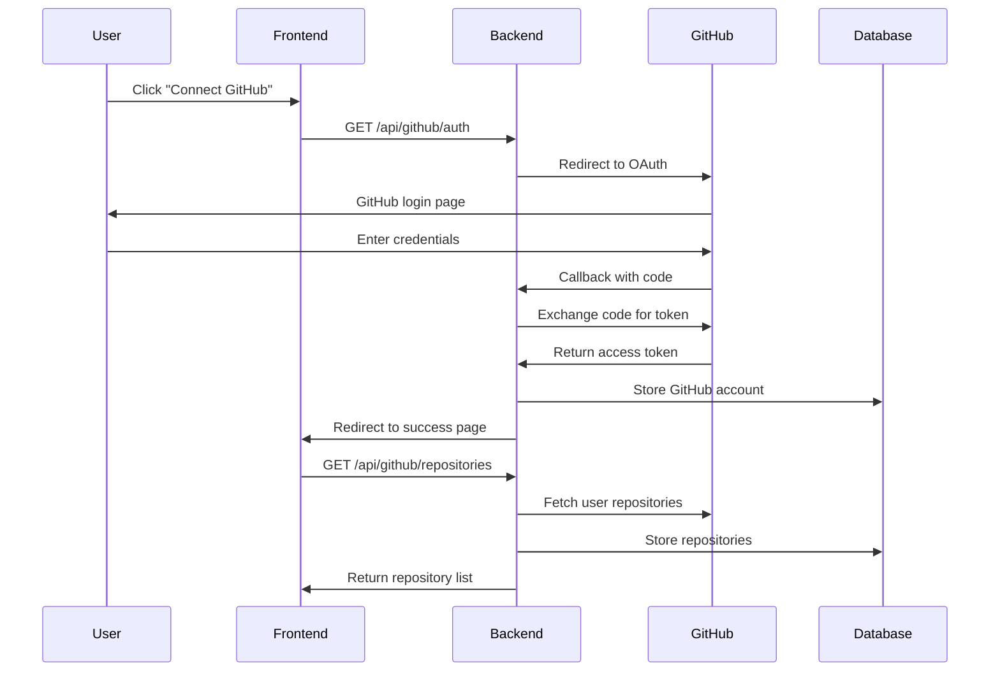
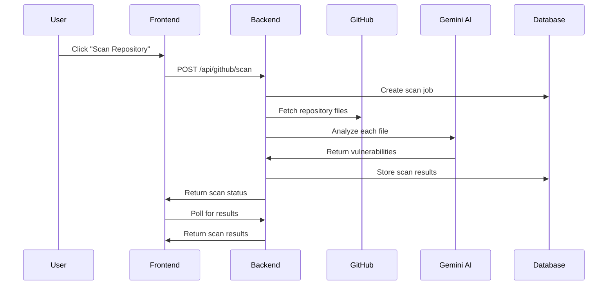

# 🔗 GitHub Integration Architecture

## 🏗️ **System Overview**

This document outlines the complete GitHub integration for Corgea, enabling users to scan their repositories for security vulnerabilities.

## 📊 **Database Schema**

### **New Tables Added:**
- `github_accounts` - Store GitHub OAuth tokens and user info
- `repositories` - Store user's GitHub repositories
- `scan_jobs` - Track scanning jobs and their status
- `scan_results` - Store scan results per file
- `vulnerability_details` - Normalized vulnerability data
- `scan_history` - Analytics and reporting data
- `user_preferences` - User settings for GitHub integration

## 🔐 **Authentication Flow**



## 🔍 **Repository Scanning Flow**



## 🛠️ **Backend Services**

### **1. GitHubService (`services/githubService.js`)**
- OAuth flow management
- GitHub API interactions
- Token management and storage
- Repository data synchronization

### **2. RepositoryScanner (`services/repositoryScanner.js`)**
- File discovery and filtering
- AI-powered code analysis
- Vulnerability processing and categorization
- Scan job management

### **3. API Routes (`routes/github.js`)**
- `/api/github/auth` - OAuth initiation
- `/api/github/callback` - OAuth callback
- `/api/github/account` - Account management
- `/api/github/repositories` - Repository listing
- `/api/github/scan` - Start repository scan
- `/api/github/scans` - Scan history and results

## 🎨 **Frontend Components**

### **1. GitHubConnect (`components/github/GitHubConnect.tsx`)**
- OAuth connection UI
- Account status display
- Connection management

### **2. RepositoryList (`components/github/RepositoryList.tsx`)**
- Repository listing with metadata
- Scan initiation buttons
- Progress indicators
- Vulnerability count badges

### **3. ScanResults (To be created)**
- Detailed vulnerability reports
- File-by-file analysis
- Fix suggestions display
- Export functionality

## 🔧 **Environment Variables**

### **Backend (.env)**
```env
# GitHub OAuth
GITHUB_CLIENT_ID=your_github_client_id
GITHUB_CLIENT_SECRET=your_github_client_secret
GITHUB_REDIRECT_URI=http://localhost:3000/api/github/callback

# Frontend URL
FRONTEND_URL=http://localhost:3000
```

### **Frontend (.env.local)**
```env
# Backend API
NEXT_PUBLIC_API_URL=http://localhost:4000
```

## 🚀 **Implementation Steps**

### **Phase 1: Database Setup**
1. Run the new schema migration
2. Update existing database with new tables
3. Test database connections

### **Phase 2: Backend Integration**
1. Install GitHub OAuth dependencies
2. Implement GitHub service
3. Add repository scanner
4. Create API routes
5. Test OAuth flow

### **Phase 3: Frontend Integration**
1. Create GitHub components
2. Add OAuth callback handling
3. Implement repository listing
4. Add scan initiation UI
5. Create results display

### **Phase 4: Testing & Optimization**
1. Test complete flow
2. Optimize scan performance
3. Add error handling
4. Implement caching
5. Add monitoring

## 📈 **Features Implemented**

### **✅ Core Features**
- GitHub OAuth integration
- Repository listing and management
- AI-powered code scanning
- Vulnerability detection and categorization
- Scan job tracking and status
- User preferences and settings

### **✅ Security Features**
- Secure token storage with hashing
- Scope-limited GitHub access
- User authentication required
- Repository access validation
- Rate limiting and error handling

### **✅ Performance Features**
- Batch file processing
- File size and type filtering
- Background scan processing
- Progress tracking
- Result caching

## 🔮 **Future Enhancements**

### **Advanced Features**
- Webhook integration for automatic scanning
- Scheduled scans
- Team collaboration features
- Custom scan rules
- Integration with CI/CD pipelines

### **Analytics & Reporting**
- Vulnerability trends
- Repository health scores
- Team performance metrics
- Custom dashboards
- Export capabilities

### **Enterprise Features**
- Organization-wide scanning
- Policy enforcement
- Compliance reporting
- SSO integration
- Advanced user management

## 🧪 **Testing Strategy**

### **Unit Tests**
- Service layer functions
- API endpoint responses
- Database operations
- Error handling

### **Integration Tests**
- OAuth flow end-to-end
- Repository scanning pipeline
- Frontend-backend communication
- Database transactions

### **Performance Tests**
- Large repository scanning
- Concurrent scan jobs
- API rate limiting
- Database query optimization

## 📚 **Documentation**

- API documentation with examples
- Component usage guides
- Database schema documentation
- Deployment instructions
- Troubleshooting guides

This integration transforms Corgea from a simple code scanner into a comprehensive repository security platform! 🚀

