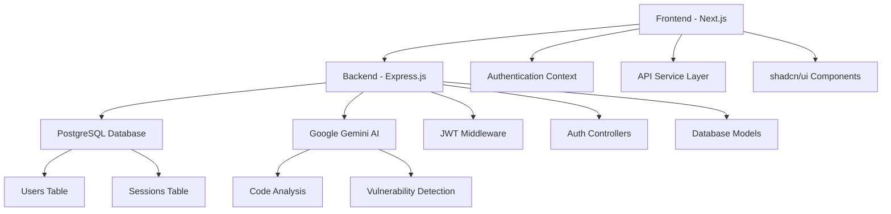

# 🛡️ AISecure - AI-Powered Code Security Scanner

<div align="center">


[](https://nextjs.org/)
[](https://nodejs.org/)
[](https://postgresql.org/)
[](https://typescriptlang.org/)
[](https://tailwindcss.com/)

**An intelligent code security scanner powered by Google Gemini AI with user authentication and modern UI**

[🚀 Live Demo](#-live-demo) • [📖 Documentation](#-documentation) • [🛠️ Installation](#-installation) • [🤝 Contributing](#-contributing)

</div>

---

## ✨ Features

### 🔐 **Authentication & Security**
- **JWT-based authentication** with secure token management
- **Password hashing** using bcrypt with salt rounds
- **Protected routes** with automatic token validation
- **Session management** with database-backed token storage

### 🤖 **AI-Powered Analysis**
- **Google Gemini AI integration** for intelligent code analysis
- **Real-time vulnerability detection** with detailed explanations
- **Severity classification** (High, Medium, Low)
- **Actionable fix suggestions** with code examples

### 🎨 **Modern User Interface**
- **shadcn/ui components** for consistent, beautiful design
- **Responsive layout** that works on all devices
- **Dark/Light theme support** with CSS variables
- **Real-time error handling** with user-friendly messages

### 🔍 **Security Analysis Capabilities**
- **SQL Injection detection** and prevention suggestions
- **Authentication vulnerabilities** identification
- **Input validation issues** detection
- **Business logic flaws** analysis
- **API security** assessment

---

## 🏗️ Architecture



---

## 🚀 Live Demo

> **Note**: This is a development version. For production deployment, see the [Deployment](#-deployment) section.

### 🌐 **Try it out:**
1. **Register** a new account
2. **Login** with your credentials  
3. **Paste your code** in the editor
4. **Click "Scan Code"** to analyze
5. **Review vulnerabilities** and suggested fixes

---

## 📖 Documentation

### 📚 **Quick Links**
- [Installation Guide](#-installation)
- [API Documentation](#-api-documentation)
- [Configuration](#-configuration)
- [Troubleshooting](#-troubleshooting)
- [Contributing Guidelines](#-contributing)

### 🔧 **Setup Instructions**

#### **Prerequisites**
- Node.js 18+ 
- PostgreSQL 12+
- Google Gemini API key

#### **Environment Variables**
```env
# Backend (.env)
DB_HOST=localhost
DB_PORT=5432
DB_NAME=AISecure_auth
DB_USER=postgres
DB_PASSWORD=your_password
JWT_SECRET=your-secret-key
PORT=4000

# Frontend (.env.local)
GEMINI_API_KEY=your_gemini_api_key
NEXT_PUBLIC_API_URL=http://localhost:4000
```

---

## 🛠️ Installation

### **1. Clone the Repository**
```bash
git clone https://github.com/yourusername/AISecure.git
cd AISecure
```

### **2. Backend Setup**
```bash
cd Backend
npm install
npm run init-db
npm run dev
```

### **3. Frontend Setup**
```bash
cd frontend
npm install
npm run dev
```

### **4. Database Setup**
```sql
-- Create database
CREATE DATABASE AISecure_auth;

-- Tables will be created automatically by the init script
```

---

## 🎯 Usage

### **Code Scanning**
1. **Login** to your account
2. **Paste code** in the editor
3. **Click "Scan Code"**
4. **Review results**:
   - Vulnerability details
   - Severity levels
   - Fix suggestions
   - Line-by-line analysis

### **Example Code to Test**
```javascript
app.post("/purchase", (req, res) => {
    const { userId, productId, price } = req.body;
    db.purchase(userId, productId, price); // trusting client input
    res.send("Success");
});
```

### **Expected Output**
- ⚠️ **SQL Injection Vulnerability** (High)
- ⚠️ **Broken Authentication** (High)  
- ⚠️ **Input Validation Issues** (Medium)
- 💡 **Fix suggestions** with secure code examples

---

## 🔌 API Documentation

### **Authentication Endpoints**

| Method | Endpoint | Description | Auth Required |
|--------|----------|-------------|---------------|
| `POST` | `/api/auth/register` | Register new user | ❌ |
| `POST` | `/api/auth/login` | Login user | ❌ |
| `GET` | `/api/auth/profile` | Get user profile | ✅ |
| `POST` | `/api/auth/logout` | Logout user | ✅ |

### **Code Analysis Endpoints**

| Method | Endpoint | Description | Auth Required |
|--------|----------|-------------|---------------|
| `POST` | `/scan` | Analyze code for vulnerabilities | ✅ |

### **Example API Usage**
```javascript
// Register user
const response = await fetch('/api/auth/register', {
  method: 'POST',
  headers: { 'Content-Type': 'application/json' },
  body: JSON.stringify({
    email: 'user@example.com',
    password: 'password123',
    firstName: 'John',
    lastName: 'Doe'
  })
});

// Scan code
const scanResult = await fetch('/scan', {
  method: 'POST',
  headers: { 
    'Content-Type': 'application/json',
    'Authorization': `Bearer ${token}`
  },
  body: JSON.stringify({
    code: 'your code here',
    filename: 'example.js'
  })
});
```

---

## 🏗️ Project Structure

```
AISecure/
├── 📁 Backend/                 # Express.js API server
│   ├── 📁 config/             # Database configuration
│   ├── 📁 controllers/        # Route controllers
│   ├── 📁 middleware/         # Authentication middleware
│   ├── 📁 routes/             # API routes
│   ├── 📁 scripts/            # Database setup scripts
│   └── 📄 index.js            # Server entry point
├── 📁 frontend/               # Next.js React application
│   ├── 📁 src/
│   │   ├── 📁 app/            # Next.js app directory
│   │   ├── 📁 components/     # React components
│   │   ├── 📁 contexts/       # React contexts
│   │   └── 📁 lib/            # Utility functions
│   └── 📄 package.json
├── 📄 .gitignore              # Git ignore rules
└── 📄 README.md               # This file
```

---

## 🔧 Configuration

### **Database Configuration**
```javascript
// Backend/config/database.js
const dbConfig = {
  user: process.env.DB_USER,
  host: process.env.DB_HOST,
  database: process.env.DB_NAME,
  password: process.env.DB_PASSWORD,
  port: process.env.DB_PORT,
  max: 20,
  idleTimeoutMillis: 30000,
  connectionTimeoutMillis: 2000
};
```

### **AI Configuration**
```javascript
// Frontend/src/lib/ai.ts
const genAI = new GoogleGenerativeAI(process.env.GEMINI_API_KEY);
const model = genAI.getGenerativeModel({ model: 'gemini-1.5-flash' });
```

---

## 🚀 Deployment

### **Backend Deployment**
```bash
# Production build
npm run build
npm start

# Environment variables
export DB_HOST=your-production-host
export DB_PASSWORD=your-production-password
export JWT_SECRET=your-production-secret
```

### **Frontend Deployment**
```bash
# Build for production
npm run build
npm start

# Deploy to Vercel
vercel --prod
```

### **Database Migration**
```sql
-- Run the schema creation script
\i scripts/create-tables.sql
```

---

## 🧪 Testing

### **Run Tests**
```bash
# Backend tests
cd Backend
npm test

# Frontend tests  
cd frontend
npm test
```

### **Test Coverage**
- ✅ Authentication flow
- ✅ API endpoints
- ✅ Database operations
- ✅ AI integration
- ✅ Error handling

---

## 🐛 Troubleshooting

### **Common Issues**

| Issue | Solution |
|-------|----------|
| Database connection failed | Check PostgreSQL credentials and service |
| Authentication errors | Verify JWT_SECRET is set |
| AI analysis fails | Check GEMINI_API_KEY is valid |
| Frontend build errors | Clear .next cache and reinstall dependencies |

### **Debug Mode**
```bash
# Enable debug logging
DEBUG=true npm run dev
```

---

## 🤝 Contributing

We welcome contributions! Please see our [Contributing Guidelines](CONTRIBUTING.md) for details.

### **Development Setup**
1. Fork the repository
2. Create a feature branch
3. Make your changes
4. Add tests
5. Submit a pull request

### **Code Style**
- Use TypeScript for type safety
- Follow ESLint configuration
- Write meaningful commit messages
- Add JSDoc comments for functions

---

## 📄 License

This project is licensed under the MIT License - see the [LICENSE](LICENSE) file for details.

---

## 🙏 Acknowledgments

- **Google Gemini AI** for intelligent code analysis
- **shadcn/ui** for beautiful UI components
- **Next.js** for the React framework
- **PostgreSQL** for reliable data storage
- **Tailwind CSS** for utility-first styling

---

## 📞 Support

- 📧 **Email**: support@AISecure.dev
- 🐛 **Issues**: [GitHub Issues](https://github.com/yourusername/AISecure/issues)
- 💬 **Discussions**: [GitHub Discussions](https://github.com/yourusername/AISecure/discussions)

---

<div align="center">

**Made with ❤️ by the AISecure Team**

[⭐ Star this repo](https://github.com/yourusername/AISecure) • [🐛 Report Bug](https://github.com/yourusername/AISecure/issues) • [💡 Request Feature](https://github.com/yourusername/AISecure/issues)

</div>
